# BesiGourmet Step-by-Step

A guide to web development on the Microsoft Azure platform with an end-to-end example

* Microsoft Azure Concepts
* Develpment Tools
* Collaborating on code development
* Continuous Integration, Delivery and Deployment

## Prerequisites

* Latest Visual Studio
* [Visual Studio Code](https://code.visualstudio.com/)
* [.NET Core 2.1 SDK](https://www.microsoft.com/net/download)
* [git](https://git-scm.com/downloads)

## Architecture

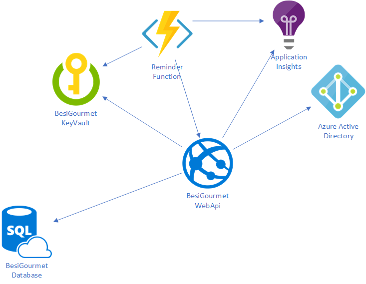

## Create new ASP.NET Core Web Application

* Add a new project in Visual Studio `ASP.NET Core Web Application`

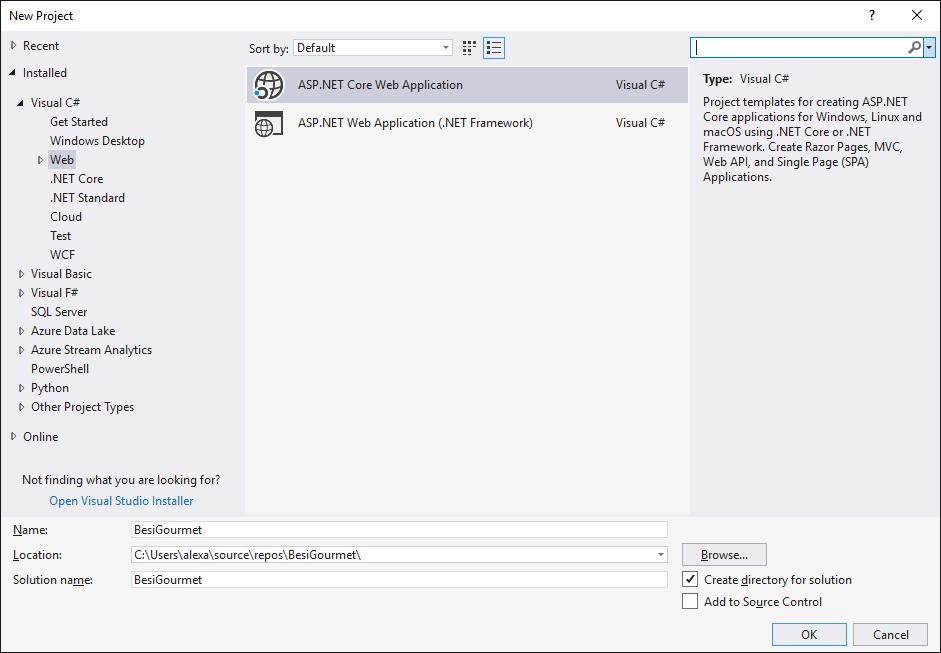

* Choose API Template

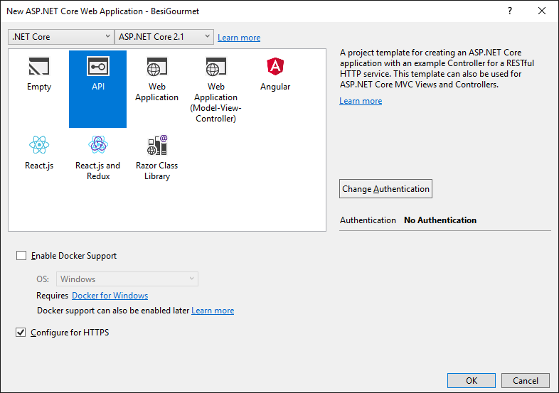

A basic ASP.NET Core Web API project is created with the basic project structure and some basic controllers

## Configure configuration system

Basically, the template generates everything you need in terms of configuration. An instance of ``IConfiguration`` is already in the startup constructor. If you want more control over how the configuration system is configured, you can exchange the generated constructor with the following variant:

```cs
public Startup(IHostingEnvironment env)
{
    var builder = new ConfigurationBuilder()
        .SetBasePath(env.ContentRootPath)
        .AddJsonFile(
            $"appsettings.json",
            optional: false, reloadOnChange: true)
        .AddEnvironmentVariables();
    if (env.IsDevelopment()) builder.AddUserSecrets<Startup>();
    Configuration = builder.Build();
}
```

## Configure Swagger

* [Swagger/OpenAPI](https://docs.microsoft.com/en-us/aspnet/core/tutorials/web-api-help-pages-using-swagger?view=aspnetcore-2.1)
* [Swashbuckle](https://docs.microsoft.com/en-us/aspnet/core/tutorials/getting-started-with-swashbuckle?view=aspnetcore-2.1&tabs=visual-studio%2Cvisual-studio-xml)
* Add the package `Swashbuckle.AspNetCore` from NuGet
* Add a new folder `StartupRegistrar`. The folder holds utility classes the help register differen services. One of them being Swagger.
* Add a static class `SwaggerRegistrar`
* Add the following code to the class

```cs
/// <summary>
/// Configure swagger generator
/// </summary>
/// <param name="services"></param>
public static void AddSwagger(IServiceCollection services)
{
    // add some metadata for the doc to generate
    services.AddSwaggerGen(c =>
    {
        c.SwaggerDoc("v1", new Info
        {
            Title = "BesiGourmet.WebApi",
            Version = "v1",
            License = new License
            {
                Name = "(c) by Besi"
            }
        });

        var basePath = AppContext.BaseDirectory;
        var xmlPath = Path.Combine(basePath, "BesiGourmet.WebApi.xml");
        c.IncludeXmlComments(xmlPath);
    });
}

/// <summary>
/// Add swagger middleware / endpoint
/// </summary>
/// <param name="app"></param>
public static void UseSwaggerMiddleware(IApplicationBuilder app)
{
    app.UseSwagger();
    app.UseSwaggerUI(c =>
    {
        c.SwaggerEndpoint("/swagger/v1/swagger.json",
            "BesiGourmet.WebApi API V1");
    });
}
```

* Add `SwaggerRegistrar.AddSwagger(services);` to the `ConfigureServices` method in `Startup`

```cs
// This method gets called by the runtime. Use this method to add services to the container.
public void ConfigureServices(IServiceCollection services)
{
    // setup swagger
    SwaggerRegistrar.AddSwagger(services);

    //services.AddAuthentication(AzureADDefaults.BearerAuthenticationScheme)
    //    .AddAzureADBearer(options => Configuration.Bind("AzureAd", options));
    // services.AddMvc().SetCompatibilityVersion(CompatibilityVersion.Version_2_1);
}
```

* Add `SwaggerRegistrar.UseSwaggerMiddleware(app);` to the `Configure` method in `Startup`

```cs
if (env.IsDevelopment())
{
    app.UseDeveloperExceptionPage();
}
else
{
    app.UseHsts();
}

// setup swagger middleware
SwaggerRegistrar.UseSwaggerMiddleware(app);

app.UseHttpsRedirection();
////app.UseAuthentication();
app.UseMvc();
```

* Configure the XML documenations file in the project settings. It the correct file is not set, the application will throw an error on startup

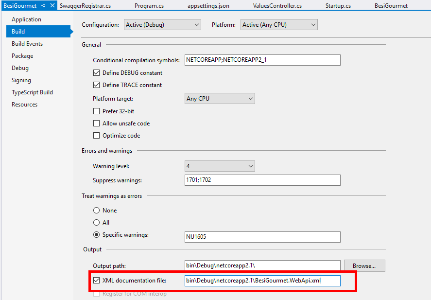


## Add data access

* [Simple Example](https://docs.microsoft.com/en-us/ef/core/get-started/aspnetcore/new-db?tabs=visual-studio)
* [Use existing database](https://docs.microsoft.com/en-us/ef/core/get-started/aspnetcore/existing-db)

This tutorial uses Entity Framework Core to connect to a Azure SQL database.

* Install the EF Core provider for [Sql Server](https://www.nuget.org/packages/Microsoft.EntityFrameworkCore.SqlServer) in Visual Studio. Select the package in version 2.3 as otherwise Visual Studio will throw a version conflict.
For a list of additional providers see [here](https://docs.microsoft.com/en-us/ef/core/providers/index).

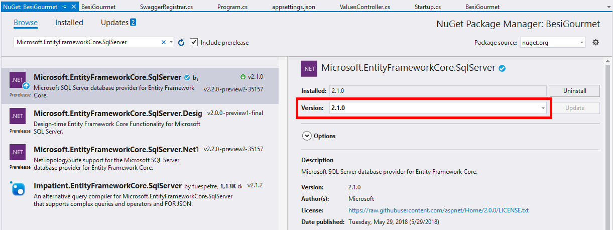

### Add a basic data model with code first approach

* Add a new folder `Database` to the project. This folder will contain all database-related classes.
* Add a new class `DatabaseContext` to the folder `Database` and copy the following content in the class.
* Add the following files to your `Database` folder
  * Allergens.cs
  * Dish.cs
  * DishAllergen.cs
  * Menu.cs
  * MenuOrder.cs
  * MenuPlan.cs
  * MissingMenuOrderReminder.cs
  * User.cs

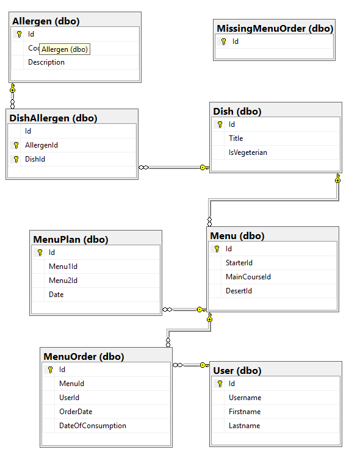

* Add the following properties to the `DatabaseContext` class

```cs
public DbSet<Menu> Menu { get; set; }

public DbSet<Allergen> Allergen { get; set; }

public DbSet<MenuOrder> MenuOrder { get; set; }

public DbSet<MissingMenuOrderReminder> MissingMenuOrder { get; set; }

public DbSet<User> User { get; set; }

public DbSet<MenuPlan> MenuPlan { get; set; }

protected override void OnModelCreating(ModelBuilder modelBuilder)
{
modelBuilder.Entity<DishAllergen>()
.HasKey(bc => new { bc.DishId, bc.AllergenId });

modelBuilder.Entity<DishAllergen>()
.HasOne(bc => bc.Dish)
.WithMany(b => b.DishAllergens)
.HasForeignKey(bc => bc.DishId);

modelBuilder.Entity<DishAllergen>()
.HasOne(bc => bc.Allergen)
.WithMany(c => c.DishAllergens)
.HasForeignKey(bc => bc.AllergenId);

modelBuilder.Entity<Menu>()
.HasOne(b => b.Starter)
.WithMany()
.OnDelete(DeleteBehavior.Restrict);

modelBuilder.Entity<Menu>()
.HasOne(b => b.MainCourse)
.WithMany()
.OnDelete(DeleteBehavior.Restrict);

modelBuilder.Entity<Menu>()
.HasOne(b => b.Desert)
.WithMany()
.OnDelete(DeleteBehavior.Restrict);

modelBuilder.Entity<MenuPlan>()
.HasOne(b => b.Menu1)
.WithMany()
.OnDelete(DeleteBehavior.Restrict);

modelBuilder.Entity<MenuPlan>()
.HasOne(b => b.Menu2)
.WithMany()
.OnDelete(DeleteBehavior.Restrict);

this.SeedData(modelBuilder);
}

private void SeedData(ModelBuilder modelBuilder)
{
#region allergens
var a = new Allergen { Id = Guid.Parse("b8671bad-d096-4a06-b0fb-c7bbe8bdaa35"), Code = "A", Description = "Glutenhaltiges Getreide und daraus gewonnene Erzeugnisse" };
var b = new Allergen { Id = Guid.Parse("f1ef4b1f-af99-4fa8-9793-ce1a34c96e95"), Code = "B", Description = "Krebstiere und daraus gewonnene Erzeugnisse" };
var c = new Allergen { Id = Guid.Parse("84a90738-c08f-415d-8819-790e1683aa60"), Code = "C", Description = "Eier von Geflügel und daraus gewonnene Erzeugnisse" };
var d = new Allergen { Id = Guid.Parse("17567a74-a17b-41eb-b1d9-b77b59613bba"), Code = "D", Description = "Fisch und daraus gewonnene Erzeugnisse (ausser Fischgelatine)" };
var e = new Allergen { Id = Guid.Parse("1b3d8e5e-8d83-443a-b923-6ff1e0ab4b3e"), Code = "E", Description = "Erdnüsse und daraus gewonnene Erzeugnisse" };

var allergens = new[] { a, b, c, d, e, };
#endregion

#region dishes
// starters
var dish6 = new Dish { Id = Guid.Parse("ea26695e-32ab-4d0a-aa63-2a2fd1d845a6"), Title = "Fritattensuppe", IsVegeterian = false };
var dish7 = new Dish { Id = Guid.Parse("71aeb877-d026-4b2f-a285-3ab25ce8079d"), Title = "Grüner Salat", IsVegeterian = false };
var dish8 = new Dish { Id = Guid.Parse("db1a947a-1316-490f-a13c-21049c2a47ec"), Title = "Kürbiscremesuppe", IsVegeterian = false };

// mains
var dish1 = new Dish { Id = Guid.Parse("f2cbbd62-50ee-441d-a426-10adf2e7702d"), Title = "Schnitzel mit Reis", IsVegeterian = false };
var dish2 = new Dish { Id = Guid.Parse("2c0eda9c-a8d2-4003-aa1e-4cefec42a525"), Title = "Kaiserschmarrn mit Zwetschkenröster", IsVegeterian = true };
var dish3 = new Dish { Id = Guid.Parse("ac3aeeb9-8e15-424f-ab3c-b76c81c7ed2c"), Title = "Currypfanne mit Fisch", IsVegeterian = false };
var dish4 = new Dish { Id = Guid.Parse("3245fad8-7e2c-4f35-a927-142143970911"), Title = "Gebackene Champions", IsVegeterian = true };
var dish5 = new Dish { Id = Guid.Parse("be302ff1-a6e0-471f-a481-f52cf6e00c53"), Title = "Backhendl mit Vogerlsalat", IsVegeterian = false };

// desert
var dish9 = new Dish { Id = Guid.Parse("c8a7d53c-e2a1-4aa2-a82b-cca7f91d340a"), Title = "Gemischtes Eis", IsVegeterian = true };
var dish10 = new Dish { Id = Guid.Parse("c10a9afb-48bd-420f-8994-36bffb55601d"), Title = "Vanillepudding", IsVegeterian = true };
var dish11 = new Dish { Id = Guid.Parse("a0bff874-1181-416c-99c7-f169098bce68"), Title = "Käseplatte mit Weintrauben", IsVegeterian = true };

var dishes = new[] { dish6, dish7, dish8, dish1, dish2, dish3, dish4, dish5, dish9, dish10, dish11 };
#endregion

#region dishAllergens
var dish6Allergen1 = new DishAllergen { DishId = dish6.Id, AllergenId = a.Id };
var dish6Allergen2 = new DishAllergen { DishId = dish6.Id, AllergenId = b.Id };

var dish7Allergen1 = new DishAllergen { DishId = dish7.Id, AllergenId = a.Id };

var dish8Allergen1 = new DishAllergen { DishId = dish8.Id, AllergenId = a.Id };
var dish8Allergen2 = new DishAllergen { DishId = dish8.Id, AllergenId = b.Id };

var dish1Allergen1 = new DishAllergen { DishId = dish1.Id, AllergenId = b.Id };
var dish1Allergen2 = new DishAllergen { DishId = dish1.Id, AllergenId = d.Id };
var dish1Allergen3 = new DishAllergen { DishId = dish1.Id, AllergenId = a.Id };

var dish2Allergen1 = new DishAllergen { DishId = dish2.Id, AllergenId = c.Id };
var dish2Allergen2 = new DishAllergen { DishId = dish2.Id, AllergenId = d.Id };
var dish2Allergen3 = new DishAllergen { DishId = dish2.Id, AllergenId = a.Id };

var dish3Allergen1 = new DishAllergen { DishId = dish3.Id, AllergenId = d.Id };
var dish3Allergen2 = new DishAllergen { DishId = dish3.Id, AllergenId = b.Id };
var dish3Allergen3 = new DishAllergen { DishId = dish3.Id, AllergenId = e.Id };

var dish4Allergen1 = new DishAllergen { DishId = dish4.Id, AllergenId = d.Id };
var dish4Allergen2 = new DishAllergen { DishId = dish4.Id, AllergenId = e.Id };

var dish5Allergen1 = new DishAllergen { DishId = dish5.Id, AllergenId = a.Id };
var dish5Allergen2 = new DishAllergen { DishId = dish5.Id, AllergenId = b.Id };
var dish5Allergen3 = new DishAllergen { DishId = dish5.Id, AllergenId = c.Id };
var dish5Allergen4 = new DishAllergen { DishId = dish5.Id, AllergenId = d.Id };
var dish5Allergen5 = new DishAllergen { DishId = dish5.Id, AllergenId = e.Id };

var dishAllergens = new[] { dish6Allergen1, dish6Allergen2, dish7Allergen1, dish8Allergen1, dish8Allergen2 };
#endregion

#region menus
// starters
var menu1 = new Menu { Id = Guid.Parse("b05db3a3-3a73-4a77-8d14-edcf5c97c26e"), StarterId = dish6.Id, MainCourseId = dish1.Id, DesertId = dish9.Id };
var menu2 = new Menu { Id = Guid.Parse("4cbec5f7-508f-4f09-96a7-2a5f69e63a10"), StarterId = dish7.Id, MainCourseId = dish2.Id, DesertId = dish10.Id };
var menu3 = new Menu { Id = Guid.Parse("3bd04bdc-9b34-4e3f-984f-c9bdef93eb31"), StarterId = dish8.Id, MainCourseId = dish3.Id, DesertId = dish11.Id };
var menu4 = new Menu { Id = Guid.Parse("d495f77c-5818-4217-aded-d3afa7884ed8"), StarterId = dish8.Id, MainCourseId = dish4.Id, DesertId = dish9.Id };
var menu5 = new Menu { Id = Guid.Parse("c7be0a47-0022-4504-8eb0-e81ce39287a8"), StarterId = dish7.Id, MainCourseId = dish5.Id, DesertId = dish11.Id };
var menu6 = new Menu { Id = Guid.Parse("b1ad2b15-bd8c-44b1-9961-ced0c864857b"), StarterId = dish6.Id, MainCourseId = dish4.Id, DesertId = dish10.Id };
var menu7 = new Menu { Id = Guid.Parse("c1de3bfc-cad7-45e4-a876-ab91c40121a1"), StarterId = dish7.Id, MainCourseId = dish3.Id, DesertId = dish10.Id };
var menu8 = new Menu { Id = Guid.Parse("6e116e17-6dcc-4fe2-9195-4e5bb25d84ef"), StarterId = dish6.Id, MainCourseId = dish2.Id, DesertId = dish11.Id };
var menu9 = new Menu { Id = Guid.Parse("d2fed096-ca8c-4586-914e-b71a1674c607"), StarterId = dish8.Id, MainCourseId = dish1.Id, DesertId = dish9.Id };

var menus = new[] { menu1, menu2, menu3, menu4, menu5, menu6, menu7, menu8, menu9 };
#endregion

#region menuplan

var menuplanMonday1 = new MenuPlan { Id = Guid.Parse("2fcdec11-75a8-46f8-a863-0c09edbda186"), Date = new DateTime(2018, 10, 1), Menu1Id = menu1.Id, Menu2Id = menu2.Id };
var menuplanTuesday1 = new MenuPlan { Id = Guid.Parse("1e1242d0-a506-495b-bb8a-6fe975fa16da"), Date = new DateTime(2018, 10, 2), Menu1Id = menu2.Id, Menu2Id = menu3.Id };
var menuplanWednesday1 = new MenuPlan { Id = Guid.Parse("3f6bc956-a055-4d4a-b420-33aa1027861c"), Date = new DateTime(2018, 10, 3), Menu1Id = menu3.Id, Menu2Id = menu4.Id };
var menuplanThursday1 = new MenuPlan { Id = Guid.Parse("480f9569-6252-446e-a1f7-3a4a15242a13"), Date = new DateTime(2018, 10, 4), Menu1Id = menu4.Id, Menu2Id = menu5.Id };
var menuplanFriday1 = new MenuPlan { Id = Guid.Parse("e56a47cb-9db6-4827-b488-5ea836743a7b"), Date = new DateTime(2018, 10, 5), Menu1Id = menu5.Id, Menu2Id = menu6.Id };

var menuplanMonday2 = new MenuPlan { Id = Guid.Parse("240c50c2-c209-4e99-b493-5391bf51e6d7"), Date = new DateTime(2018, 10, 8), Menu1Id = menu3.Id, Menu2Id = menu4.Id };
var menuplanTuesday2 = new MenuPlan { Id = Guid.Parse("f4d29af4-a070-498c-bd49-4ea9e1c862c9"), Date = new DateTime(2018, 10, 9), Menu1Id = menu4.Id, Menu2Id = menu5.Id };
var menuplanWednesday2 = new MenuPlan { Id = Guid.Parse("f36dd6bc-baef-4690-8800-2b6137d88261"), Date = new DateTime(2018, 10, 10), Menu1Id = menu5.Id, Menu2Id = menu6.Id };
var menuplanThursday2 = new MenuPlan { Id = Guid.Parse("9a54335c-55a4-4a5e-80f9-9e458af86121"), Date = new DateTime(2018, 10, 11), Menu1Id = menu6.Id, Menu2Id = menu7.Id };
var menuplanFriday2 = new MenuPlan { Id = Guid.Parse("7ac61fe9-eb6c-4d00-8bf9-d84b880f735f"), Date = new DateTime(2018, 10, 12), Menu1Id = menu7.Id, Menu2Id = menu8.Id };

var menuplanMonday3 = new MenuPlan { Id = Guid.Parse("71a3b6e6-15a2-49b5-8349-d07a0c80afb9"), Date = new DateTime(2018, 10, 15), Menu1Id = menu5.Id, Menu2Id = menu6.Id };
var menuplanTuesday3 = new MenuPlan { Id = Guid.Parse("32223c3c-7be1-4183-9e16-c1d066367f27"), Date = new DateTime(2018, 10, 16), Menu1Id = menu6.Id, Menu2Id = menu7.Id };
var menuplanWednesday3 = new MenuPlan { Id = Guid.Parse("81e2ed71-a46d-4586-909a-b5102ce3231f"), Date = new DateTime(2018, 10, 17), Menu1Id = menu7.Id, Menu2Id = menu8.Id };
var menuplanThursday3 = new MenuPlan { Id = Guid.Parse("ffec2e49-5031-44cb-b58f-0eb527137e78"), Date = new DateTime(2018, 10, 18), Menu1Id = menu8.Id, Menu2Id = menu9.Id };
var menuplanFriday3 = new MenuPlan { Id = Guid.Parse("4e57187f-bc86-4db2-9f10-a6a226dfc23e"), Date = new DateTime(2018, 10, 19), Menu1Id = menu9.Id, Menu2Id = menu1.Id };

var menuplans = new[] { menuplanMonday1, menuplanTuesday1, menuplanWednesday1, menuplanThursday1, menuplanFriday1, menuplanMonday2, menuplanTuesday2, menuplanWednesday2, menuplanThursday2, menuplanFriday2, menuplanMonday3, menuplanTuesday3, menuplanWednesday3, menuplanThursday3, menuplanFriday3 };

#endregion

modelBuilder.Entity<Allergen>().HasData(allergens);
modelBuilder.Entity<Dish>().HasData(dishes);
modelBuilder.Entity<DishAllergen>().HasData(dishAllergens);
modelBuilder.Entity<Menu>().HasData(menus);
modelBuilder.Entity<MenuPlan>().HasData(menuplans);
}
```

* Register the `DatabaseContext` with dependency injection during application startup. In `Startup.cs` add the using statements:

```cs
using BesiGourmet.Database;
using Microsoft.EntityFrameworkCore;
```

* Add the following code to the `ConfigureServices` methods:

```cs
services.AddDbContext<DatabaseContext> (options => options.UseSqlServer(Configuration["ConnectionString"]));
```

### Initial creation of the database

* Open Tools > NuGet Package Manager > Package Manager Console in Visual Studio. This initiales PowerShell which we need next
* Type the follwoing command in the console.
```cs
Add-Migration InitialCreate
Update-Database
```
* The command `Add-Migration InitialCreate` creates a new folder `Migrations` with a C# file that contains your data model scripted in C#. It reflects your code for EF related things and generates the migrations file from it.

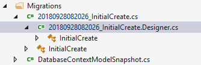

* The command `Update-Database` propagates the changes to the actual database. It implicitely looks in your setting for the connection string to your code and applies the changes.

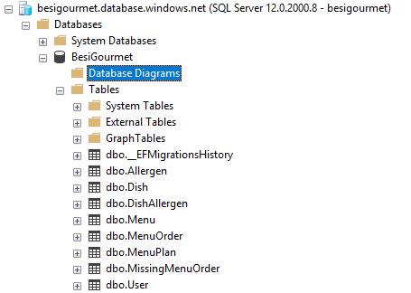

Note: The two above commands are helpful during development time. However, when your applications runs in production, you can use `Database.MigrateAsync()`

* If you add new tables, or columns etc, just add it to your code and rerun the commands:

```cs
Add-Migration InitialCreate
Update-Database
```

## Implement Controllers

### DefaultController

* Add a new class to the `Controller` folder and name it `DefaultController`
* Add the attribute `[Produces("application/json")]` to the class
* Add the data context to the controller

```cs
private readonly DatabaseContext _context;

public DefaultController(DatabaseContext context)
{
    _context = context;
}
```

##### [GET] Menu and Menuplan

```cs
/// <summary>
/// Get menus
/// </summary>
/// <returns></returns>
[HttpGet("menu")]
[ProducesResponseType(typeof(Menu), 200)]
public ActionResult<Menu> GetMenu()
{
    var menus = _context.Menu.Include<Menu>("Starter")
        .Include<Menu, Dish>(x => x.Starter)
        .Include<Menu, Dish>(x => x.MainCourse)
        .Include<Menu, Dish>(x => x.Desert);
    return Ok(menus);
}

/// <summary>
/// Get menu plan for a given start date
/// </summary>
/// <returns></returns>
[HttpGet("menuplan/{date}")]
[ProducesResponseType(typeof(MenuPlan), 200)]
public ActionResult<MenuPlan> GetMenuPlan([FromRoute] DateTime date)
{
    var menuPlan = _context.MenuPlan.Where(x => x.Date == date)
        .Include("Menu1.Starter")
        .Include("Menu1.MainCourse")
        .Include("Menu1.Desert")
        .Include("Menu2.Starter")
        .Include("Menu2.MainCourse")
        .Include("Menu2.Desert");
    return Ok(menuPlan);
}
```

* In the run selection choose `BesiGourment` instead of `IIS Expression` and hit F5

**Note:** Take a look at swagger and how it is changing

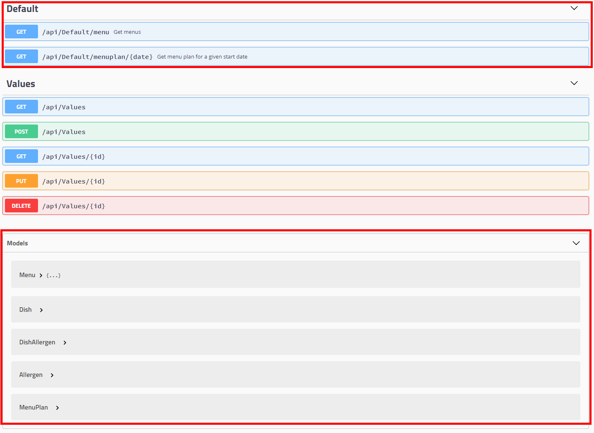

We can now query menu plans and menus.

#### [PUT, POST] Add dishes and update allergens

## Add Logging (Application Insights)

* Install the nuget package `Microsoft.ApplicationInsights.AspNetCore`
* Add the application insights middleware by adding the following code to your `ConfigureServices` method in `Startup.cs`

```cs
services.AddApplicationInsightsTelemetry();
```

* Alternatively, you can enable Application Insights by adding `.UseApplicationInsights();` to your `DefaultBuilder` in `Program.cs`

* Fetch the `Instrumentation Key` from the Azure Portal (properties page) and add the following code to your `appsettings.json` file.

```json
"ApplicationInsights": {
    "InstrumentationKey": "5a3f0ee2-caa1-46ca-9b69-a7544b91c34d"
}
```

**Note:** Replace the above instrumentation key with your actual key.

* To review the different kinds of telemetry see [here](https://docs.microsoft.com/en-us/azure/application-insights/app-insights-api-custom-events-metrics).

* To trace an exception add the following code to `GetMenu` method:

```cs
try
{
    throw new Exception("Foo");
}
catch (Exception e)
{
    _telemetry.TrackException(new ExceptionTelemetry { Exception = e });
}
```

* To track an operation replace the implementation of AddMenuOrder with the following code:

```cs
using (var operation = _telemetry.StartOperation<RequestTelemetry>("AddMenuOrder"))
{
    _telemetry.TrackTrace("Parsing payload...");
    _context.MenuOrder.Add(order);
    _telemetry.TrackTrace("Added order to set...");
    _context.SaveChanges();
    _telemetry.TrackTrace("Saved changes to db...");
}

return NoContent();
```

### Links

* https://github.com/Microsoft/ApplicationInsights-aspnetcore/wiki/Getting-Started-with-Application-Insights-for-ASP.NET-Core

## Add AAD authentication

### AAD Setup
* Add a new AAD app `BesiGourmet` in your Azure Active Directory for the Web Api. This app represents the backend of our app
* Change the App ID URI to `https://gourmet.besi.com`

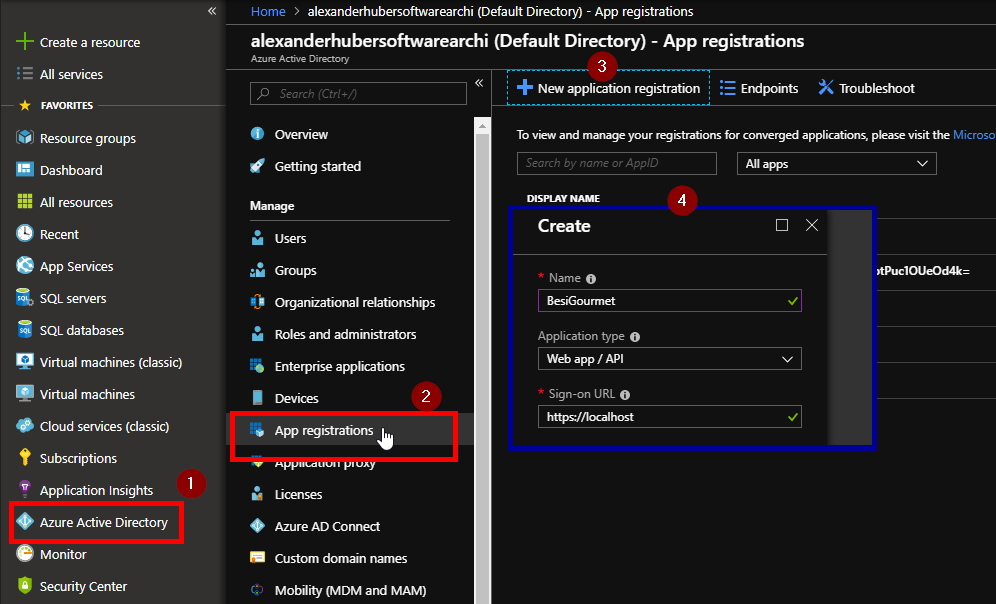

* Copy the follwoing values to your appsettings.json
  * Instance
  * Domain
  * AAD TenantID
  * ClientId
  * Audience

These settings are used to validate the token you are using to authenticate.

* Add a second AAD app that represents a client that consumes the Web Api, e.g. a PHP frontend

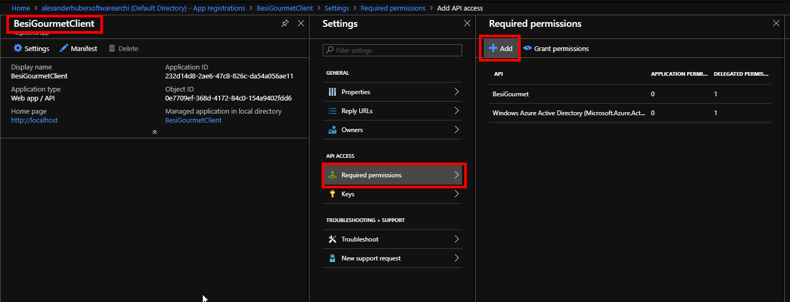

* Click `Select an API`, type! `BesiGourmet` select the app and click Select.

### Fetching Tokens

* Querying metadata: GET https://login.microsoftonline.com/{{TenantId}}/v2.0/.well-known/openid-configuration

* Access Token: https://login.microsoftonline.com/alexanderhubersoftwarearchi.onmicrosoft.com/oauth2/v2.0/authorize?client_id=232d14d8-2ae6-47c8-826c-da54a056ae11&response_type=id_token+token&redirect_uri=https%3A%2F%2Flocalhost%3A44307%2Fsignin-oidc&response_mode=fragment&scope=openid%20https%3A%2F%2Fgourmet.besi.com%2Fuser_impersonation&state=12345&nonce=678910

  * client_id: App Id of the aad app
  * response_type: add `token` to fetch an access token
  * redirect_uri: Redirect Uri configured in AAD
  * scope: App ID URI of resource aad app + scope --> https://gourmet.besi.com/user_impersonation

### Configure AAD in Web Api

* Add the following AAD settings to your `appsettings.json`

```
"AzureAd": {
    "Instance": "https://login.microsoftonline.com/",
    "TenantId": "bd24d3f2-8eb3-4e40-9c8c-1b123c8f0084",
    "AppIdUri": "https://gourmet.besi.com"
}
```

* Add the following code in your `ConfigureServices` method in `Startup.cs`

```cs
services.AddAuthorization(o =>
{
    o.AddPolicy("default", policy =>
    {
        // Require the basic "Access app-name" claim by default
        policy.RequireClaim(Constants.ScopeClaimType, "user_impersonation");
    });
});

services
    .AddAuthentication(o =>
    {
        o.DefaultScheme = JwtBearerDefaults.AuthenticationScheme;
    })
    .AddJwtBearer(o =>
    {
        o.Authority = $"{Configuration["AzureAd:Instance"]}{Configuration["AzureAd:TenantId"]}";
        o.TokenValidationParameters = new Microsoft.IdentityModel.Tokens.TokenValidationParameters
        {
            // Both App ID URI and client id are valid audiences in the access token
            ValidAudiences = new List<string>
            {
                Configuration["AzureAd:AppIdUri"]
            }
        };
    });
```

* Add the following code in your `Configure` method in `Startup.cs`

```cs
app.UseAuthentication();
```

* Add the `[Authorizes]` attribte to your `DefaultController` class

If you send an anoynmous request to your web api, you will get a `401` error. You now need to pass an access token in the Authorization header to gain access to your api.

### Links

https://joonasw.net/view/azure-ad-authentication-aspnet-core-api-part-1

## Add Key Vault

To prevent that security relevant credentials are checked in, we add Azure Key Vault support to the Web API

* Add a new Key Vault to your Azure Resource Group
* Add new configuration value in `appsettings.json`

```cs
"KeyVault": {
    "VaultUri": "add your uri"
}
```

* Add a folder `KeyVault` to the solution and a class `KVClient`
* Add the nuget package `Microsoft.Azure.Services.AppAuthentication` to your solution.


## Test Project

* Add a new test project in Visual Studio

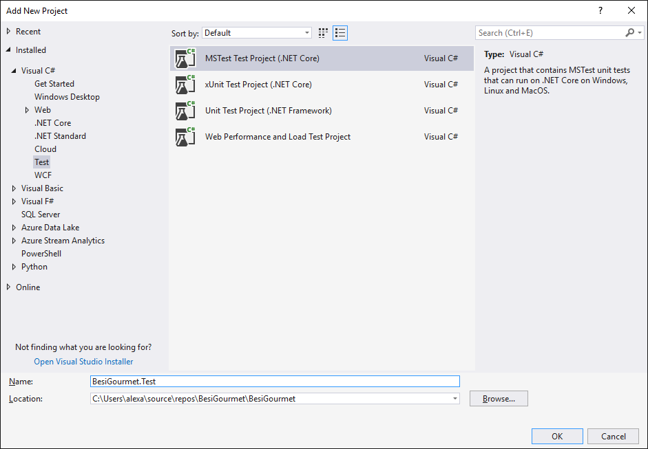

* Add nuget package `Microsoft.EntityFrameworkCore.SqlServer`

* Add the following code to your test method:

```cs
var optionsBuilder = new DbContextOptionsBuilder<DatabaseContext>();
optionsBuilder.UseSqlServer("connectionstring");
var databaseContext = new DatabaseContext(optionsBuilder.Options);
```

## Adding the reminder function

* Add a new folder `Functions` to the solution.
* In the folder add a new `Azure Function` project
* When selecting the trigger type choose `HttpTrigger`
* In the file `local.settings.json` add the following setting:
```json
"Token": "eyJ0eXAiOiJKV1QiLCJhbGciOiJSUzI1NiIsIng1dCI6Imk2bEdrM0ZaenhSY1ViMkMzbkVRN3N5SEpsWSIsImtpZCI6Imk2bEdrM0ZaenhSY1ViMkMzbkVRN3N5SEpsWSJ9.eyJhdWQiOiJodHRwczovL2dvdXJtZXQuYmVzaS5jb20iLCJpc3MiOiJodHRwczovL3N0cy53aW5kb3dzLm5ldC9iZDI0ZDNmMi04ZWIzLTRlNDAtOWM4Yy0xYjEyM2M4ZjAwODQvIiwiaWF0IjoxNTM4Mzk5MTk5LCJuYmYiOjE1MzgzOTkxOTksImV4cCI6MTUzODQwMzA5OSwiYWNyIjoiMSIsImFpbyI6IkFUUUF5LzhJQUFBQXNQS3VpWVRyejlOQis1bHVFTHVOL1lXK1dNNkthejVOUnl1VGtnM1dhalNJdVQzazNrQnYyTUtJVDF1WXJoREkiLCJhbXIiOlsicHdkIl0sImFwcGlkIjoiMjMyZDE0ZDgtMmFlNi00N2M4LTgyNmMtZGE1NGEwNTZhZTExIiwiYXBwaWRhY3IiOiIwIiwiaXBhZGRyIjoiOTEuMTEyLjQ4LjEyNSIsIm5hbWUiOiJCZXNpRGVtbzEiLCJvaWQiOiJiZjI4MTg1MC1kYjAyLTQ4ZWQtOGVmYS02N2ZmNjYyMWIwNmIiLCJzY3AiOiJ1c2VyX2ltcGVyc29uYXRpb24iLCJzdWIiOiIzZVlvbDNmNGN0ME1EeWdyZmZNOUVuSjhCN2VJamlNdDlfQTZJTkdGdnlJIiwidGlkIjoiYmQyNGQzZjItOGViMy00ZTQwLTljOGMtMWIxMjNjOGYwMDg0IiwidW5pcXVlX25hbWUiOiJiZXNpZGVtb0BhbGV4YW5kZXJodWJlcnNvZnR3YXJlYXJjaGkub25taWNyb3NvZnQuY29tIiwidXBuIjoiYmVzaWRlbW9AYWxleGFuZGVyaHViZXJzb2Z0d2FyZWFyY2hpLm9ubWljcm9zb2Z0LmNvbSIsInV0aSI6ImRRLUs3WWJUeVVTeUE2XzlsYTBuQVEiLCJ2ZXIiOiIxLjAifQ.W_boh5OyqJQ5D07RIU_sxnhJVV_gsiISLNlXZqcFRsN611uLURMgSXvPf3hPw6PgoLKfCRuvH9_o9iWD3Ld-qJn_LQUJTwcOWrDJ5uJToN8RZPpx6SjmwnbG8sKqGc0V0ZLAkTF_W9gjlQybpyxUkjEySN2Wnv_QNGzc5ncncT143Lh20-FbpJZEUTv6lRmmEylofsRkT1VqekAbYtziAFn5WNTJZc282QOPwq6FYqZctZXvrK3FNmPi7XQ99e8GnBNXQv4PFS5telGxCsXiPG9YvhPO-5Ui3sYJ1T-Tk1ZUEHJa9VtLequ5mApJ-usRhA4dTYwLar7FCZm31uAhkA"
```

and 

```json
"BesiGourmetUri": "http://localhost:5000"
```

* Add the two follwoing variables to the `HttpTrigger` class

```cs
private static readonly HttpClient _httpClient;
private static readonly IConfigurationRoot _config;
```

* Add the following constructor to initialize the `_httpClient` and `_config` fied:

```cs
static HttpTriggered()
{
    _httpClient = new HttpClient();

    _config = new ConfigurationBuilder()
        .SetBasePath(Directory.GetCurrentDirectory())
        .AddJsonFile("local.settings.json", optional: true, reloadOnChange: true)
        .AddEnvironmentVariables()
        .Build();
}
```

* Add the following code to the `Main` method

```cs
log.LogInformation("C# HTTP trigger function processed a request.");

try
{
    string date = req.Query["date"];
    string userId = req.Query["userid"];

    _httpClient.DefaultRequestHeaders.Authorization = new AuthenticationHeaderValue("Bearer", _config["Token"]);

    var result = await _httpClient.GetAsync($"{_config["BesiGourmetUri"]}/api/default/menuorder/missing/{date}/{userId}");
    var content = await result.Content.ReadAsStringAsync();

    // todo: send mails to users

    return (ActionResult)new OkObjectResult(content);
}
catch (Exception e)
{

    log.LogError(e.Message, e.StackTrace);
    return (ActionResult)new BadRequestObjectResult(e);
}
```

* Deploy the function from Visual Studio


## Azure DevOps

### Create a new organisation in ADO

* Navigate to [Azure Dev Ops](https://dev.azure.com/)

* Click `+ New organization` and enter the necessary data.

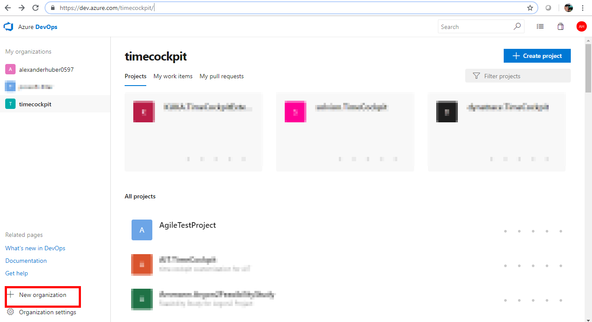

### Add a new project to your ADO organization

* Click `+ Create project` and enter a name.

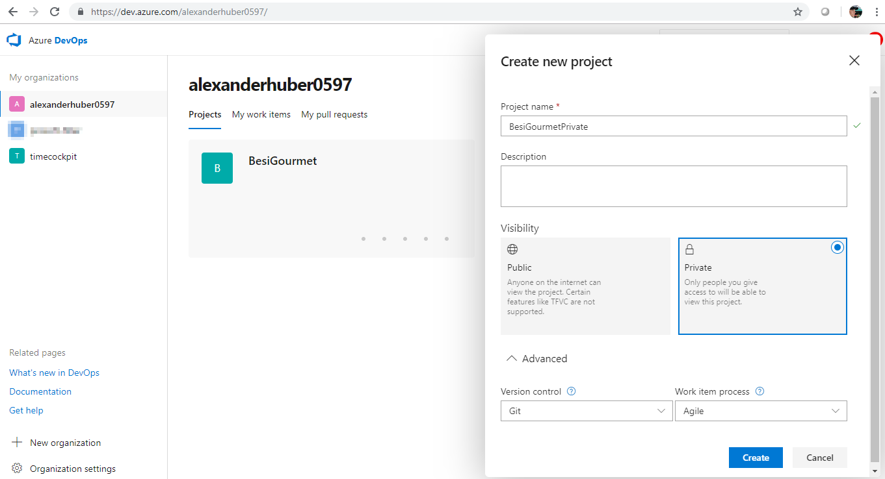

* Choose **Git** as version control and choose **Agile** as work item process. You can choose between three different processes. You can review the differences at:

  * [Agile](https://docs.microsoft.com/en-us/azure/devops/boards/work-items/guidance/agile-process?toc=/azure/devops/boards/work-items/toc.json&bc=/azure/devops/boards/work-items/breadcrumb/toc.json&view=vsts)
  * [Scrum](https://docs.microsoft.com/en-us/azure/devops/boards/work-items/guidance/scrum-process?toc=/azure/devops/boards/work-items/toc.json&bc=/azure/devops/boards/work-items/breadcrumb/toc.json&view=vsts)
  * [CMMI](https://docs.microsoft.com/en-us/azure/devops/boards/work-items/guidance/cmmi-process?toc=/azure/devops/boards/work-items/toc.json&bc=/azure/devops/boards/work-items/breadcrumb/toc.json&view=vsts)

### Create a repository

* Clone empty repository to your computer

### Azure pipelines

* Create new build pipeline

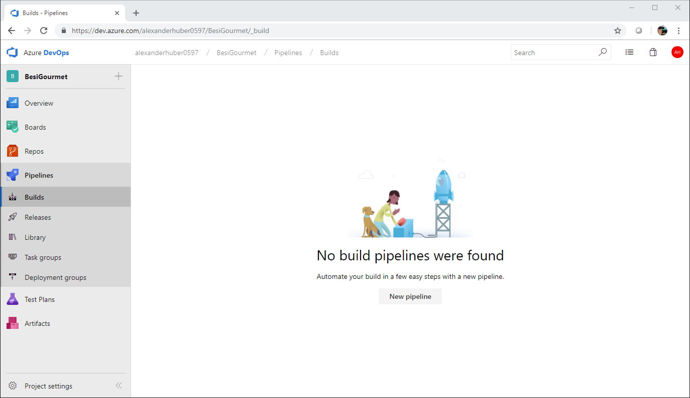

* Select **Azure Repos** as your code repository

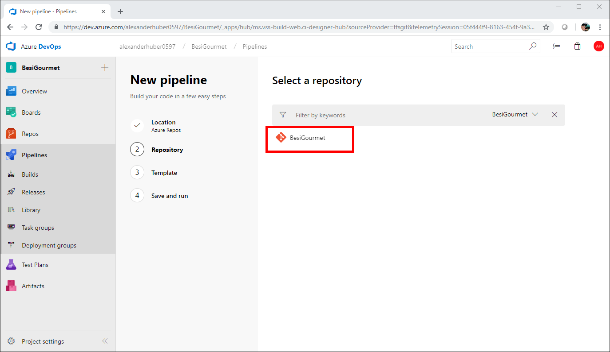

* Select a template for your pipeline. There are various for different platforms, e.g. PHP, NodeJS or ASP.NET Core. For this project we use **ASP.NET Core**.

* After selecting **ASP.NET Core** you are presented with a basic build definition in YAML. Click **Save and run**. You will be asked to commit the pipeline to your repo.

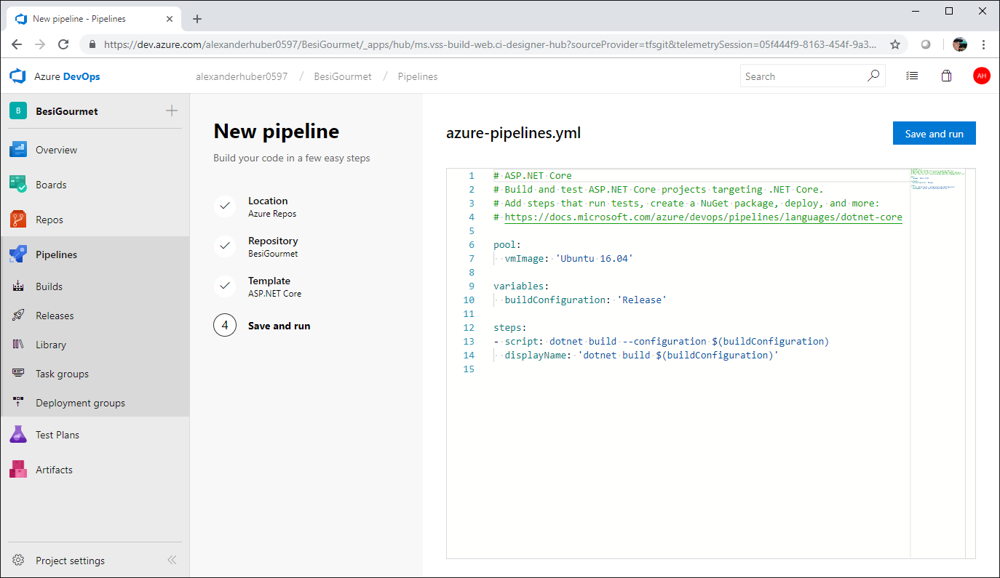

* You will find a file `azure-pipelines.yml` in your repo root.

* The job will fail because no project or solution is selected. 

#### Edit azure-pipelines

* Navigate to your source code and edit `azure-pipelines.yml`
* Change `vmImage` to `VS2017-Win2016`
* Change `buildConfiguration` to `Debug`. This is because we want to be able to remote debug later.


### Links
* General info: https://docs.microsoft.com/en-us/azure/devops/pipelines/languages/dotnet-core?view=vsts&tabs=yaml
* [Build task documentation](https://docs.microsoft.com/en-us/azure/devops/pipelines/tasks/?view=vsts)